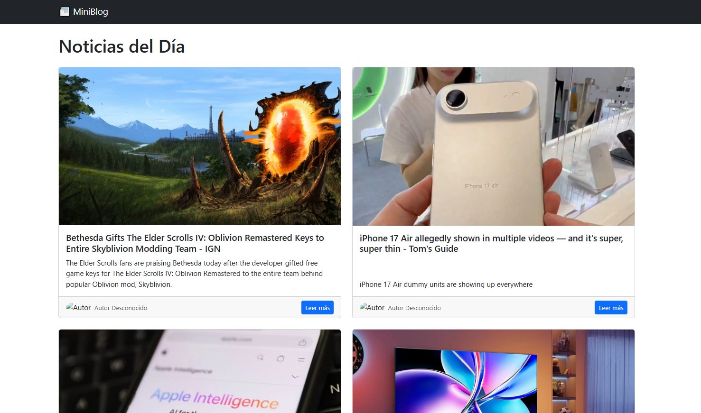

# 📰 Blog Noticiero con PHP + Bootstrap

Este proyecto es un blog/noticiero dinámico que consume datos en tiempo real de dos APIs públicas: [News API](https://newsapi.org/) para mostrar noticias actualizadas y [Random User API](https://randomuser.me/) para generar autores ficticios para cada post.

## 🚀 Características

- 📰 Muestra 10 noticias por página
- 🧑‍💻 Cada noticia tiene un autor generado aleatoriamente
- 📄 Paginación funcional
- 🎨 Diseño simple y responsive con Bootstrap
- 💡 Código claro y organizado

## 🛠 Tecnologías Utilizadas

- PHP
- Bootstrap 5
- News API
- Random User API

## 🧪 Cómo ejecutar en local

1. Cloná el repositorio:
   ```bash
   git clone https://github.com/letus404/noticieroPHP.git
   cd noticieroPHP

2. Corré el servidor:
php -S localhost:8000

💡 Nota: Necesitás una API key de News API para que funcione correctamente. Podés colocarla en el archivo config.php.

✅ Requerimientos cumplidos:

✅ Uso de News API para noticias
✅ Uso de Random User API para autores
✅ Paginación implementada
✅ Bootstrap para diseño limpio y responsive
✅ Código claro y modular




Creado por Mariano Quinteros 